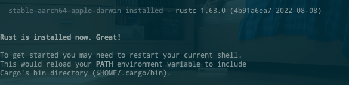
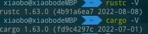
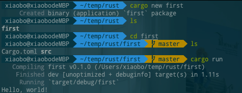
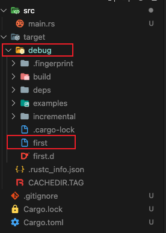
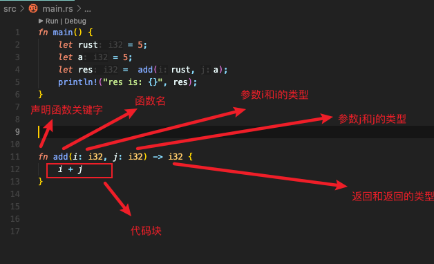

<!-- TOC -->

- [1. rust](#1-rust)
    - [1.1 rust是什么](#11-rust是什么)
    - [1.2 为什么选择rust](#12-为什么选择rust)
- [2. 安装rust](#2-安装rust)
- [3. 第一个rust程序](#3-第一个rust程序)
    - [3.1 直接运行](#31-直接运行)
    - [3.2 编译运行](#32-编译运行)
    - [3.3 模式和项目结构](#33-模式和项目结构)
- [4. rust的基础语法](#4-rust的基础语法)
    - [4.0 变量绑定](#40-变量绑定)
    - [4.1 所有权-解决内存并发问题](#41-所有权-解决内存并发问题)
    - [4.2 基础数据类型](#42-基础数据类型)
    - [4.3 常量](#43-常量)
    - [4.4 函数](#44-函数)
    - [4.5 流程控制](#45-流程控制)
        - [if](#if)
        - [loop循环](#loop循环)
        - [for循环](#for循环)
- [5. 网站](#5-网站)

<!-- /TOC -->

# 1.rust


## 1.1 rust是什么


Rust 是一门注重安全、速度和并发的现代系统编程语言。Rust 没有GC也没有手动内存管理，内存安全，无GC 也就是说 没有STW，像go java这些就是有个gc的(我们不需要管理内存，像C就是要用自己申请，不负责)，。


Rust是一个强类型的语言，也就是在编译时进行检查。可以在运行时检查参数的类型是否正确，也就是说如果参数类型是string,编译成功以后那么就可以保证函数只会接受是string类型的，消除了与类型相关的错误的可能性。

对于内存方面,编程语言是需要和内存打交道的，要用就申请，不用就释放
像java,go 有GC，代替我们管理
c++是手动管理内存的分配和释放, 
rust是通过所有权来管理内存，编译器在编译时会根据规则进行检查

## 1.2 为什么选择rust


官网上面说的


对于个人来说
- 1.新出的语言(2015年正式出了第一个版本)，新的编程语言。
- 2.兴趣,比较有趣的语言，尝试着了解，保持兴趣。
- 3.在量化交易，区块链,加密货币相关方面比较流行。https://github.com/chainx-org/ChainX 


对于企业来说

- 1.是否需要一个高性能的系统和高精度的控制
- 2.对安全和正确要求是不是很高,rust的内存管理，内存分配等
- 3.系统跑又快又安全是不是一定有必要，是不是值得投入，相比较其它语言构建的系统提升对用户有没有什么帮助

对于系统本身来说
- 1.如果是执行处理请求，处理业务逻辑，做出响应的web场景，就没有必要
- 2.系统对于故障的感知压力不是很大，
- 3.对于性能来说，不需要那么高的并发处理，而且就算有，通过基础设施扩容或者提高费用就可以解决(计划之中的情况)，就不是那么必要
- 4.面向对象的语言自然有它的优势领域，而rust就不行了


# 2.安装rust


mac下面直接输入即可，会安装最新的版本。

```
curl --proto '=https' --tlsv1.2 https://sh.rustup.rs -sSf | sh
```


看见下面的就成功了




然后查看rust版本 和 cargo版本

```bash
rustc -V
cargo -V
```



> cargo是一个类似于nodejs的npm一样，使用它可以直接创建一个空项目。


# 3.第一个rust程序


## 3.1直接运行

创建一个项目

```
cargo new first
```

直接运行
```
cargo run
```




## 3.2编译运行


构建

```
cargo build
    Finished dev [unoptimized + debuginfo] target(s) in 0.01s

```

运行

```
./target/debug/first
Hello, world!

```


## 3.3 模式和项目结构

**1.之前是在debug模式构建下**



> 代码的编译速度会比较快，运行速度就慢了，Rust编译器不会做任何的优化，会尽快的编译完成。


**2.release构建高性能代码**


```bash

cargo run --release
   Compiling first v0.1.0 (/Users/xiaobo/temp/rust/first)
    Finished release [optimized] target(s) in 0.42s
     Running `target/release/first`
Hello, world!


```

```
cargo build --release
```


运行release 程序

```
./target/release/first
Hello, world!
```

> release让发布构建更慢，但是能够得到更加彻底的优化。
> 正常来说，发行版(release)的运行速度通常比调试版(debug)快很多，在10-100倍


# 4.rust的基础语法


## 4.0 变量绑定

```rust

fn main() {
    let x = 1;
    println!("The value of x is: {}", x);
}

```

> 变量x就是5的所有权，`let x = 1` 相当于就绑定了值，默认变量x不可变，只要为它绑定值，就不能再修改 x，除非使用 `let mut  x = 1`


## 4.1 所有权-解决内存并发问题


在Rust中，每个值都有一个“所有权”。值同时只能有一个所有权，当变量离开作用域，这个值将被丢弃了。


```rust
fn main() {
    {                      // a 在这里无效, 还没有声明
        let a = "rust";   // a 是有效的
        // 使用 a
    }                      // 离开了作用域，a失效，释放资源
}
```

> 所有权是rust比较复杂的概念。包括所有权转移，借用/引用(使⽤其值但不获取其所有权)等


## 4.2 基础数据类型


- 数值类型: 有符号整数 (i8, i16, i32, i64, isize)、 无符号整数 (u8, u16, u32, u64, usize) 、浮点数 (f32, f64)、以及有理数、复数
- 字符串：字符串字面量和字符串切片 &str
- 布尔类型： true和false
- 字符类型: 表示单个 Unicode 字符，存储为 4 个字节
- 单元类型: 即 () ，其唯一的值也是 ()


```rust
 fn main() {
    // 有后缀数值类型 编译器知道a的类型是 u8
    let a = 1u8;
    //无后缀数值类型，类型取决于如何使用
    let b = 1;

    // 创建一个空动态数组） 编译器不知道什么类型
    let mut vec = Vec::new();
    
    // 把a  push进去，
    //编译器知道 是u8类型了
    vec.push(a);
}

```
> rust有类型推断，没有声明会看怎么使用这个变量

字符类型和字符串类型

```rust

let a = "你好";
let b = '😊';

```
> 所有的 Unicode 值都可以作为 Rust 字符，包括单个的中文、日文、韩文、emoji 表情符号等等，都是合法的字符类型


单元类型

```rust

fn main() {
    println!("rust,java,go");
    println!("😊");
}

```
> main函数是有返回值的，就是() 就是单元类型


## 4.3 常量

const：不可改变的值

```rust

const MAX_POINTS: u32 = 100_000;

```

> u32就是常量的类型
>

## 4.4 函数





> Rust 是强类型语言，每一个函数参数都要声明具体类型是啥


> 更多的还有，不返回


## 4.5 流程控制


### if

```rust

fn main() {
    let a = 5;
    let b = 5;
    if_fun(b,a); 
    
}


fn if_fun(a: i32,b: i32)-> i32{
    if a<b{
        print!("b is big");
    }else if a==b{
        print!("a = b");
    }
}

```
> 所有分支都必须返回相同的类型

### loop循环

```rust
fn main() {
    //可变变量
    let mut count = 0;

    // 无限循环
    loop {
      //
        count += 1;

        if count == 3 {
            println!("3");
            // 跳过这次迭代的剩下内容
            continue;
        }

        println!("{}", count);

        if count == 5 {
            // 退出循环
            break;
        }
    }
}

```

### for循环

```rust

fn main() {
    // i每次迭代中分别取 1,2,3,4,5
    for i in 1..=5 {
        println!("{}", i);
    }
    for i in 1..5 {
        println!("{}", i);
    }
}

```


# 5.网站
https://www.codewars.com/join?language=rust

