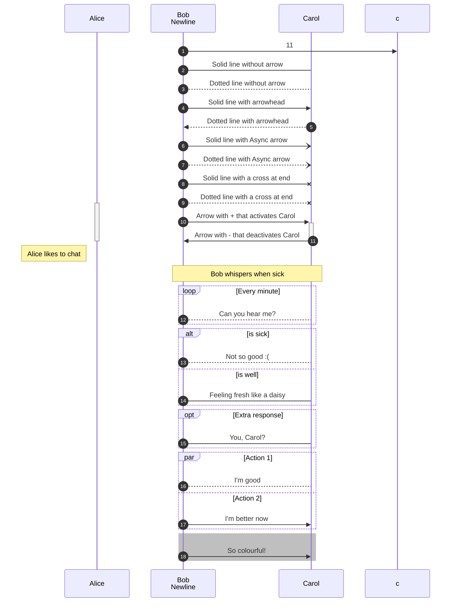

## vscode-plugins

### 画流程图

```mermaid

sequenceDiagram %% diagram
  autonumber
  %% participant
  participant Alice
  participant B as Bob<br>Newline
  participant C as Carol
  %% arrows
  B->>c:11
  B->C: Solid line without arrow
  B-->C: Dotted line without arrow
  B->>C:Solid line with arrowhead
  C-->>B: Dotted line with arrowhead
  B-)C: Solid line with Async arrow
  B--)C: Dotted line with Async arrow
  B-xC: Solid line with a cross at end
  B--xC: Dotted line with a cross at end
  %% activation, shorthand
  activate Alice
  B->>+C: Arrow with + that activates Carol
  C->>-B: Arrow with - that deactivates Carol
  deactivate Alice
  %% notes
  Note left of Alice: Alice likes to chat
  Note over B,C: Bob whispers when sick
  %% loop
  loop Every minute
    B-->C: Can you hear me?
  end
  %% alt
  alt is sick
    B-->C: Not so good :(
  else is well
    B->C: Feeling fresh like a daisy
  end
  opt Extra response
    B->C: You, Carol?
  end
  %% par
  par Action 1
    B-->C: I'm good
  and Action 2
    B->>C: I'm better now
  end
  rect rgba(128, 128, 128, 0.5)
    B->>C: So colourful!
  end

```